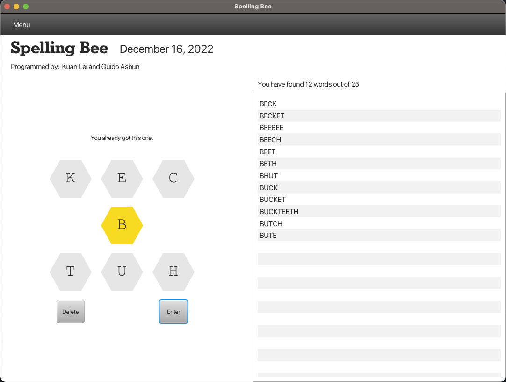

# Spelling Bee

## Programmers
| Name / Role               | LinkedIn                                            | GitHub      |
|---------------------------|-----------------------------------------------------|-------------|
| Guido Asbun / Engineering | [LinkedIn](https://www.linkedin.com/in/guidoasbun/) | [GitHub](https://github.com/guidoasbun) |
| Kuan Lei / Engineering    | [LinkedIn](https://www.linkedin.com)                | [GitHub](https://github.com/kuan1219) |

## Description

- Make words from the 7 letters in the bee hive.
- A word must contain at least 4 letters.
- And must include the center yellow letter.
- Letters can be used more than once.
- The correct words you find will be places in the words list.
- The goal is to find as many words.

## API Used
We used a free API from 
- https://freebee.fun/

And we used the endpoint GET request
- https://freebee.fun/cgi-bin/today

To get the data for our Spelling Bee Game

## Application Technology Used

- Java (SKD 19.0.1)
- JAVAFX 
- MAVEN
- Self Build Data Structures
  - Linked Lists
  - Dynamic Arrays
  - Hash Sets
